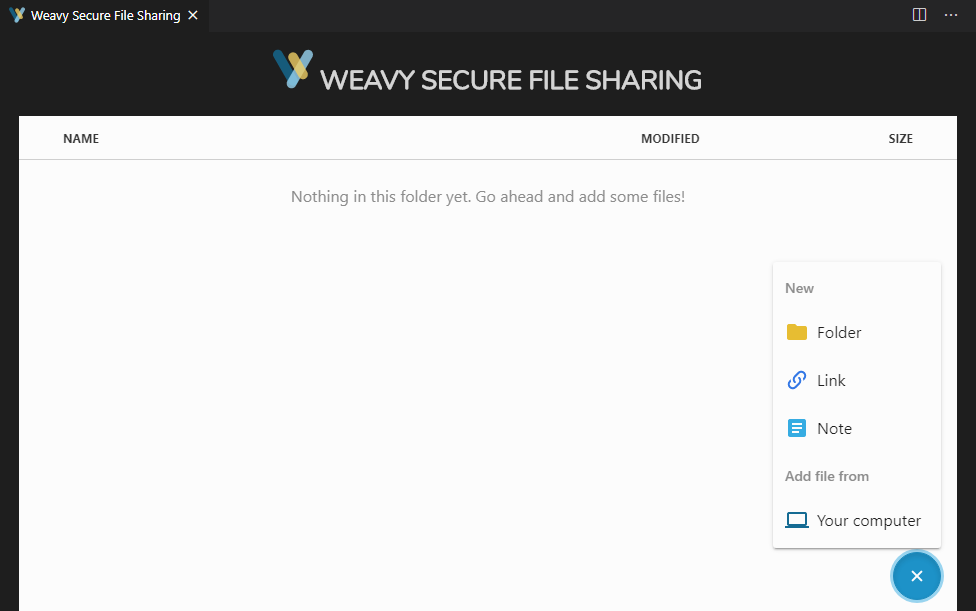
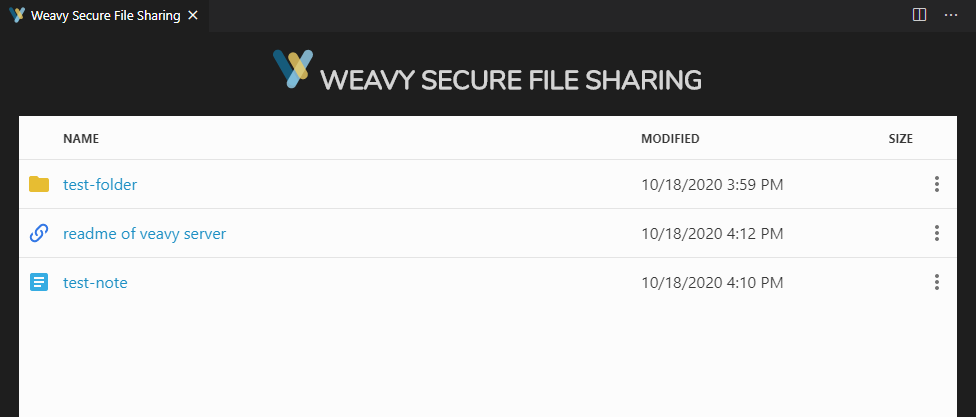
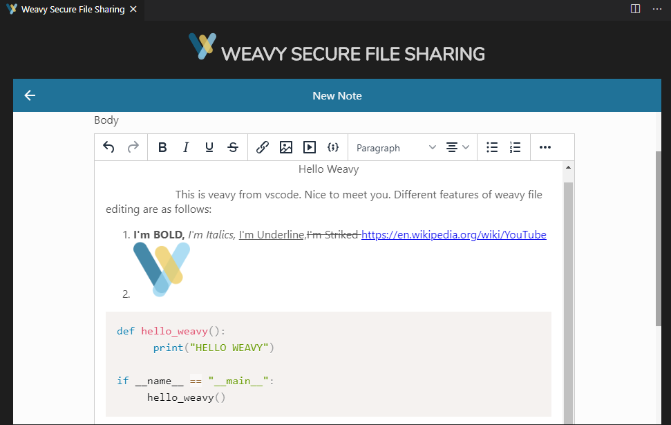

# FILES APP

## How to invoke the files app?

### Prerequisites
1. Enter the weavy javascript endpoint url in settings
1. Enter the spaces key in settings
1. Enter the mail id in settings
1. Enter the files space key in settings

### Invocation of the Files App

1. Click "Start Debugging" from the Run Menu or F5

   

1. Open Command Palette by clicking Ctrl+Shift+P. More info - https://code.visualstudio.com/docs/getstarted/tips-and-tricks#_command-palette **OR** click on the settings icon in bottom left corner of the visual code. Click on the Command Palette.

1. A new Vscode Window opens up with the extension loaded
    
1. Click the "Weavy Files" entry
1. You can see the following screen appear

4. You can create folders, links and notes as well

5. You can create a file by clicking "Note" and add content

## Limitations of Files App

1. PopUps are disabled in visual studio code. Hence, 3rd party functionalities like google doc editing, box, drop box etc support has been removed
1. Preview of video links from youtube, etc won't be working because vscode blocks cross origin requests
1. A "Link" type of file created, clicking on the file link won't open in browser as popups are blocked. But there are certain workarounds where we can communicate to vscode from our script to open those links in browser. 