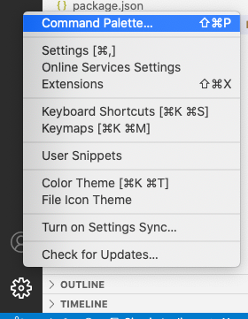

# MESSENGER APP

## How to invoke the messenger app?

### Prerequisites
1. Enter the weavy javascript endpoint url in settings
1. Enter the spaces key in settings
1. Enter the mail id in settings
1. Enter the messenger space key in settings

### Invocation of the Messenger App

1. Click "Start Debugging" from the Run Menu or F5  
   
1. Open Command Palette by clicking Ctrl+Shift+P. More info - https://code.visualstudio.com/docs/getstarted/tips-and-tricks#_command-palette **OR** click on the settings icon in bottom left corner of the visual code. Click on the Command Palette.

1. A new Vscode Window opens up with the extension loaded
    
1. Click the "Weavy Messenger" entry
1. You can see the following screen appear