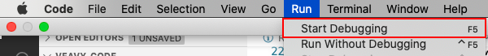

# POSTS/FEEDS APP

## How to invoke the Posts/Feeds app?

### Prerequisites
1. Enter the weavy javascript endpoint url in settings
1. Enter the spaces key in settings
1. Enter the mail id in settings
1. Enter the posts/feeds space key in settings

### Invocation of the Posts/Feeds App

1. Click "Start Debugging" from the Run Menu or F5  
   
1. Open Command Palette by clicking Ctrl+Shift+P. More info - https://code.visualstudio.com/docs/getstarted/tips-and-tricks#_command-palette **OR** click on the settings icon in bottom left corner of the visual code. Click on the Command Palette.

1. A new Vscode Window opens up with the extension loaded
    
1. Click the "Weavy Posts" entry
1. You can see the following screen appear

4. You can create a new feed. I logged in as user_2 and created a new post

5. I changed my login to abhi, liked and commented to user_2's post

## Limitations of the posts App

No known limitations exists as of now