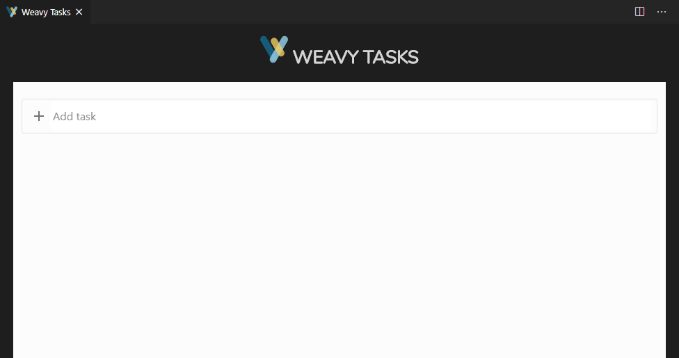
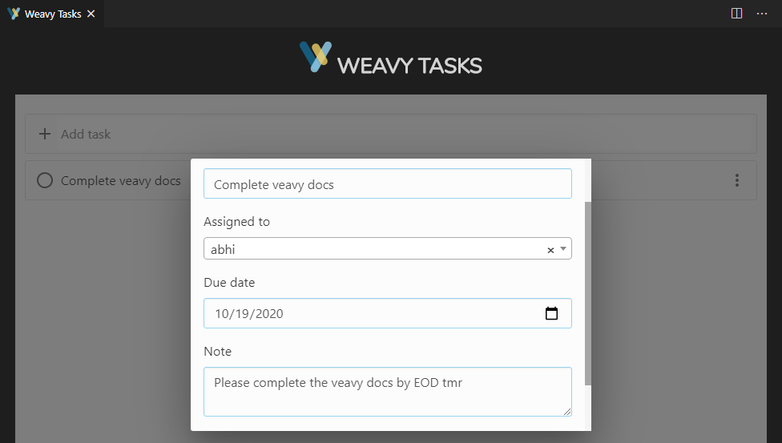
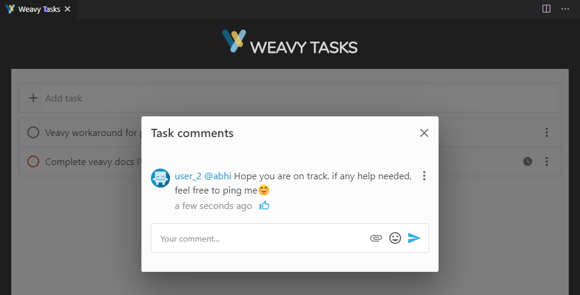
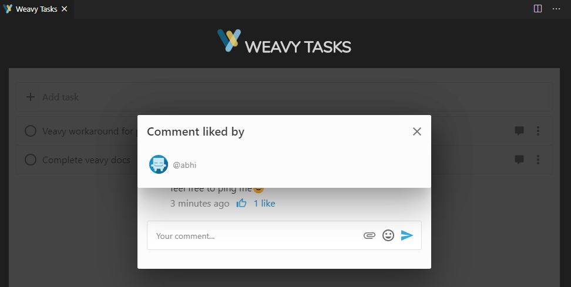

# TASKS APP

## How to invoke the tasks app?

### Prerequisites
1. Enter the weavy javascript endpoint url in settings
1. Enter the spaces key in settings
1. Enter the mail id in settings
1. Enter the tasks space key in settings

### Invocation of the Tasks App

1. Click "Start Debugging" from the Run Menu or F5  
   
1. Open Command Palette by clicking Ctrl+Shift+P. More info - https://code.visualstudio.com/docs/getstarted/tips-and-tricks#_command-palette **OR** click on the settings icon in bottom left corner of the visual code. Click on the Command Palette.

1. A new Vscode Window opens up with the extension loaded
    
1. Click the "Weavy Tasks" entry
1. You can see the following screen appear

4. I created a task as user_2 and assinged it to abhi

5. As user_2, I also commented on the task

6. Logged in as abhi and like the user_2's comment

## Limitations of the Tasks App

No known limitations as of now